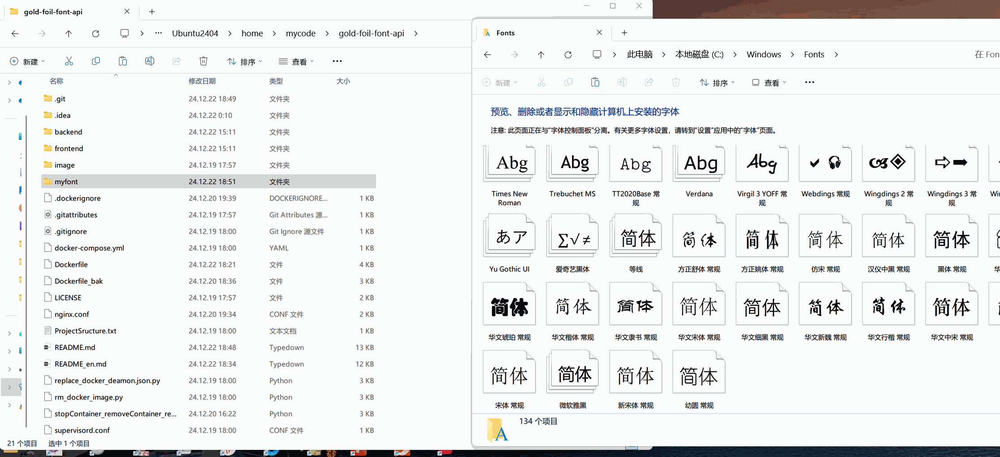

[//]: # ''


<div style="display: flex; justify-content: center; align-items: center;gap: 20px;margin: 20px">
<a href="https://github.com/isinvon/gold-foil-font-api/blob/main/README.md">

</a>

<a href="https://github.com/isinvon/gold-foil-font-api/blob/main/README_en.md">

</a>
</div>

## 🖼️ GUI 界面 ➽

下载地址: [🔗GitHub Releases](https://github.com/isinvon/gold-foil-font-api/releases)


## 🐋Docker 安装

安装之前请注意: docker 镜像我设定默认是只导入部分字体,即myfont文件中的少量字体, 如果要更多字体设置, 需要将 ttf 后缀的字体文件复制到 clone 下来的项目根目录下的`myfont`中,我已经在镜像文件中设置好了将 ttf 文件拷贝到容器中的步骤, 接下来构建镜像, 再运行容器即可
(这么做是考虑到 ttf 字体文件的占用实在太大了, 推送到仓库会导致仓库体积过大(1个G), 所以建议手动上传,具体 ttf 文件我接下来会说明)

```bash
git clone --branch docker https://github.com/isinvon/gold-foil-font-api.git # 克隆项目docker分支
cd ./gold-foil-font-api # 进入项目目录
docker build -t gold-foil-font-api . # 构建镜像
docker run -d --restart always -p 8080:8080 -p 3000:3000 gold-foil-font-api # 运行容器, 容器内部 8080为后端端口, 3000为前端端口, 宿主机映射端口需要修改请自行操作
```

### 上传自定义字体 (可选, 此步骤需要在`构建镜像`前操作)
打开资源管理器, 到`C:\Windows\Fonts`路径下, 复制所选的字体文件, 然后粘贴到咱 clone 下来的`myfont`文件夹中, 然后接下来就可以构建镜像(这一个步骤会自动将所有 ttf 字体文件拷贝到容器中), 然后就可以运行容器了


## ⚙️ 支持功能

1. 文字内容
2. 字体选择 (仅支持系统字体列表)
3. 字体颜色类型选择 (支持随机和随机渐变)
4. 背景颜色/随机背景 (支持随机)
5. 渐变方向

## 🚀 测试环境 ➽

- Windows11 系统
- Java v21 后端开发
- Springboot 3.3.6 后端框架
- Maven v3.9.8 后端构建,依赖管理工具
- JPackage21 打包
- Node.js v20.15.0 前端开发
- Vue.js v3.5.13 前端框架
- Vite v6.0.1 前端构建
- pnpm v9.14.2 包管理工具

## 接口参数列表

| 参数名                | 类型   | 默认值       | 描述                                                                                                                                                                                                                                   |
| --------------------- | ------ | ------------ | -------------------------------------------------------------------------------------------------------------------------------------------------------------------------------------------------------------------------------------- |
| text                  | String | -            | 文字内容，必填                                                                                                                                                                                                                         |
| fontType              | String | `三极泼墨体` | 字体类型，默认为`三极泼墨体`，可选值为系统字体列表                                                                                                                                                                                     |
| gradientPos           | String | `random`     | 渐变方向，默认为 `random`，可选值为 `leftToRight`、`topToBottom`、`leftTopToRightBottom`、`leftBottomToRightTop`、`rightToLeft`、`bottomToTop`、`rightTopToLeftBottom`、`rightBottomToLeftTop`、`circular`、`circularRandom`、`random` |
| fontColorType         | String | `gold`       | 字体颜色类型，默认为 `gold`，可选值为 `silver`、`black`、`blackGradient`、`custom`、`customGradient`、`random`、`randomGradient`                                                                                                       |
| fontCustomColor       | String | -            | 自定义字体颜色，无默认值，仅当 `fontColorType` 为 `custom`或者`customGradient` 时有效，仅支持十六进制颜色，例如：`#ff0000`                                                                                                             |
| isBackground          | String | `false`      | 是否使用背景，默认为 `false`，可选值为 `true`、`false`                                                                                                                                                                                 |
| isRandomBackground    | String | `false`      | 是否使用随机背景，默认为 `false`，可选值为 `true`、`false`                                                                                                                                                                             |
| backgroundCustomColor | String | -            | 自定义背景颜色，无默认值，仅当 `isBackground` 为 `true` ,且`isRandomBackground`为`false`时有效，仅支持十六进制颜色，例如：`#ff0000`                                                                                                    |

## ✨ 基本用法 ➽

### 🟡 金色 ➽

修改参数 `text` 为想要的字即可，无需加其他参数，例如:

http://localhost:8080/api/gold-foil-image?text=新年快乐


### ⚪ 银色 ➽

修改参数 `text` 为想要的字，且需要将参数 `fontColorType` 设置为 `silver`，例如:

http://localhost:8080/api/gold-foil-image?text=新年快乐&fontColorType=silver


### ⚫ 黑色 ➽

修改参数 `text` 为想要的字，且需要将参数 `fontColorType` 设置为 `black`，例如:

http://localhost:8080/api/gold-foil-image?text=新年快乐&fontColorType=black


### 🖤 黑色渐变 ➽

修改参数 `text` 为想要的字，且需要将参数 `fontColorType` 设置为 `blackGradient`，例如:

http://localhost:8080/api/gold-foil-image?text=新年快乐&fontColorType=blackGradient


## ✏️ 修改字体内容 ➽

修改参数 `text` 为想要的字即可，无需加其他参数，例如:

http://localhost:8080/api/gold-foil-image?text=66 大顺


## 🎨 修改字体颜色类型 ➽

`fontColorType`支持参数

1. `gold` - 金色
2. `silver` - 银色
3. `black` - 黑色
4. `blackGradient` - 黑色渐变
5. `custom` - 自定义
6. `customGradient` - 自定义渐变
7. `random` - 随机
8. `randomGradient` - 随机渐变

修改参数 `fontColorType` 为想要的类型:

例 1: http://localhost:8080/api/gold-foil-image?text=新年快乐&fontColorType=silver

例 2: http://localhost:8080/api/gold-foil-image?text=新年快乐&fontColorType=black

例 3: http://localhost:8080/api/gold-foil-image?text=新年快乐&fontColorType=random

例 4: http://localhost:8080/api/gold-foil-image?text=新年快乐&fontColorType=randomGradient

例 5: http://localhost:8080/api/gold-foil-image?text=新年快乐&fontColorType=custom&fontCustomColor=#ff0000

例 6: http://localhost:8080/api/gold-foil-image?text=新年快乐&fontColorType=customGradient&fontCustomGradientColor=red&fontCustomGradientColor=#999999

## 🎨 修改字体颜色 ➽

修改参数 `fontCustomColor` 为想要的颜色

需要十六进制颜色，例如: `#ff0000` (需要将`fontColorType`设置为`custom`(自定义)或者`customGradient`(自定义渐变)
才能够使用`fontCustomColor`)

自定义

例 1: http://localhost:8080/api/gold-foil-image?text=你好&fontColorType=custom&fontCustomColor=#999999

自定义渐变:

例 2: http://localhost:8080/api/gold-foil-image?text=你好&fontColorTypecustomGradient&fontCustomColor=#999999

随机

例 3: http://localhost:8080/api/gold-foil-image?text=你好&fontColorType=random

随机渐变:

例 4: http://localhost:8080/api/gold-foil-image?text=你好&fontColorType=randomGradient&fontCustomGradientColor=#999999

## 🎨 修改背景 ➽

`isBackground`支持参数

1. `true` - 开启背景
2. `false` - 关闭背景

`isRandomBackground`支持参数

1. `true` - 开启随机背景(会启动春联背景,也就是有点图案)
2. `false` - 关闭随机背景

`backgroundColor`支持参数

1. 十六进制的颜色，例如：`#ff0000`

三者结合示例:

开启随机背景(此时不允许设置背景颜色),
例 1: http://localhost:8080/api/gold-foil-image?text=鸡你太美&isBackground=true&isRandomBackground=true

关闭随机背景,
例 2: http://localhost:8080/api/gold-foil-image?text=鸡你太美&isBackground=true&isRandomBackground=false&backgroundColor=#ff0000

关闭随机背景并且不设置颜色,就会是无色的背景
例 3: http://localhost:8080/api/gold-foil-image?text=鸡你太美&isBackground=true&isRandomBackground=false

## 🏮 春联背景展示 ➽

添加参数 `isBackground` 为 `true`，例如:

http://localhost:8080/api/gold-foil-image?text=鸡你太美&isBackground=true&isRandomBackground=true

每一次请求都是随机的，所以每次请求的背景颜色都是不一样的，例如:


## ☀️ 渐变方向 ➽

`gradientPos`支持参数

1. `leftToRight` - 从左到右
2. `topToBottom` - 从上到下
3. `leftTopToRightBottom` - 从左上到右下
4. `leftBottomToRightTop` - 从左下到右上
5. `rightToLeft` - 从右到左
6. `bottomToTop` - 从下到上
7. `rightTopToLeftBottom` - 从右上到左下
8. `rightBottomToLeftTop` - 从右下到左上
9. `circular` - 圆形渐变
10. `circularRandom` - 圆形渐变(随机)

### `leftToRight` - 从左到右

添加参数 `gradientPos` 为 `leftToRight`，例如:

http://localhost:8080/api/gold-foil-image?text=鸡你太美&gradientPos=leftToRight

### `topToBottom` - 从上到下

添加参数 `gradientPos` 为 `topToBottom`，例如:

http://localhost:8080/api/gold-foil-image?text=光泽效果&gradientPos=topToBottom

### `leftTopToRightBottom` - 从左上到右下

添加参数 `gradientPos` 为 `leftTopToRightBottom`，例如:

http://localhost:8080/api/gold-foil-image?text=从左上到右下&gradientPos=leftTopToRightBottom

### `leftBottomToRightTop` - 从左下到右上

添加参数 `gradientPos` 为 `leftBottomToRightTop`，例如:

http://localhost:8080/api/gold-foil-image?text=从左下到右上&gradientPos=leftBottomToRightTop

### `rightToLeft` - 从右到左

添加参数 `gradientPos` 为 `rightToLeft`，例如:

http://localhost:8080/api/gold-foil-image?text=从右到左&gradientPos=rightToLeft

### `bottomToTop` - 从下到上

添加参数 `gradientPos` 为 `bottomToTop`，例如:

http://localhost:8080/api/gold-foil-image?text=从下到上&gradientPos=bottomToTop

### `rightTopToLeftBottom` - 从右上到左下

添加参数 `gradientPos` 为 `rightTopToLeftBottom`，例如:

http://localhost:8080/api/gold-foil-image?text=从右上到左下&gradientPos=rightTopToLeftBottom

### `rightBottomToLeftTop` - 从右下到左上

添加参数 `gradientPos` 为 `rightBottomToLeftTop`，例如:

http://localhost:8080/api/gold-foil-image?text=从右下到左上&gradientPos=rightBottomToLeftTop

### `circular` - 圆形

添加参数 `gradientPos` 为 `circular`，例如:

http://localhost:8080/api/gold-foil-image?text=圆形渐变&gradientPos=circular

### `circularRandom` - 圆形随机

添加参数 `gradientPos` 为 `circularRandom`，例如:

http://localhost:8080/api/gold-foil-image?text=圆形随机&gradientPos=circularRandom

### `random` - 随机 (如果不加 gradientPos 参数，默认就是这个随机的)

添加参数 `gradientPos` 为 `random`，例如:

http://localhost:8080/api/gold-foil-image?text=随机渐变&gradientPos=random

## 🌟 SVG 生成 (其他参数和 image 相同,用法一样)

将`http://localhost:8080/api/gold-foil-image`
换成`http://localhost:8080/api/gold-foil-svg`
就是请求生成 svg 了

例如, 请使用以下接口

http://localhost:8080/api/gold-foil-svg?text=你好

请求之后出现如下页面, 直接复制即可


