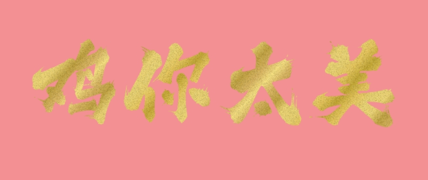

[//]: # ()

## 🖼️ GUI Interface ➽

GUI refactored by Electron (due to some issues with Jpackage packaging, webview cannot be launched on some user systems)

Download: [🔗GitHub Releases](https://github.com/isinvon/gold-foil-font-api/releases)

## 🧐 Possible issues that may be encountered

😿 Due to the fact that the program is developed based on a webview GUI, if the system does not specify a default
browser (any one is acceptable), there may be issues where it cannot be opened. Please manually set the system's default
browser before use.

## ⚙️ Supported Features

1. Text content
2. Font selection (supports system fonts only)
3. Font color type selection (supports random and random gradient)
4. Background color/random background (supports random)
5. Gradient direction

## 🚀 Test Environment ➽

- Windows 11
- Java v21 for backend development
- Spring Boot 3.3.6 backend framework
- Maven v3.9.8 for backend build and dependency management
- JPackage21 for packaging
- Node.js v20.15.0 for frontend development
- Vue.js v3.5.13 frontend framework
- Vite v6.0.1 frontend build tool
- pnpm v9.14.2 package manager

## API Parameters

| Parameter             | Type   | Default  | Description                                                                                                                                                                                                                                           
|-----------------------|--------|----------|-------------------------------------------------------------------------------------------------------------------------------------------------------------------------------------------------------------------------------------------------------
| text                  | String | -        | The text content, required                                                                                                                                                                                                                            
| fontType              | String | `三极泼墨体`  | Font type, defaults to `三极泼墨体`. You can choose the system font.                                                                                                                                                                                       
| gradientPos           | String | `random` | Gradient direction, defaults to `random`. Options: `leftToRight`, `topToBottom`, `leftTopToRightBottom`, `leftBottomToRightTop`, `rightToLeft`, `bottomToTop`, `rightTopToLeftBottom`, `rightBottomToLeftTop`, `circular`, `circularRandom`, `random` 
| fontColorType         | String | `gold`   | Font color type, defaults to `gold`. Options: `silver`, `black`, `blackGradient`, `custom`, `customGradient`, `random`, `randomGradient`                                                                                                              
| fontCustomColor       | String | -        | Custom font color, only effective when `fontColorType` is `custom` or `customGradient`. Accepts hex color codes like `#ff0000`.                                                                                                                       
| isBackground          | String | `false`  | Whether to use a background, defaults to `false`. Options: `true`, `false`                                                                                                                                                                            
| isRandomBackground    | String | `false`  | Whether to use a random background, defaults to `false`. Options: `true`, `false`                                                                                                                                                                     
| backgroundCustomColor | String | -        | Custom background color, only effective when `isBackground` is `true` and `isRandomBackground` is `false`. Accepts hex color codes like `#ff0000`.                                                                                                    

## ✨ Basic Usage ➽

### 🟡 Gold ➽

Set the parameter `text` to the desired content without adding other parameters. Example:

http://localhost:8080/api/gold-foil-image?text=新年快乐

### ⚪ Silver ➽

Set the parameter `text` to the desired content and set `fontColorType` to `silver`. Example:

http://localhost:8080/api/gold-foil-image?text=新年快乐&fontColorType=silver

### ⚫ Black ➽

Set the parameter `text` to the desired content and set `fontColorType` to `black`. Example:

http://localhost:8080/api/gold-foil-image?text=新年快乐&fontColorType=black

### 🖤 Black Gradient ➽

Set the parameter `text` to the desired content and set `fontColorType` to `blackGradient`. Example:

http://localhost:8080/api/gold-foil-image?text=新年快乐&fontColorType=blackGradient

## ✏️ Modify Text ➽

Set the parameter `text` to the desired content without adding other parameters. Example:

http://localhost:8080/api/gold-foil-image?text=66大顺

## 🎨 Modify Font Color Type ➽

`fontColorType` supports the following options:

1. `gold` - Gold
2. `silver` - Silver
3. `black` - Black
4. `blackGradient` - Black Gradient
5. `custom` - Custom
6. `customGradient` - Custom Gradient
7. `random` - Random
8. `randomGradient` - Random Gradient

Set the `fontColorType` parameter to the desired type:

Example 1: http://localhost:8080/api/gold-foil-image?text=新年快乐&fontColorType=silver

Example 2: http://localhost:8080/api/gold-foil-image?text=新年快乐&fontColorType=black

Example 3: http://localhost:8080/api/gold-foil-image?text=新年快乐&fontColorType=random

Example 4: http://localhost:8080/api/gold-foil-image?text=新年快乐&fontColorType=randomGradient

Example 5: http://localhost:8080/api/gold-foil-image?text=新年快乐&fontColorType=custom&fontCustomColor=#ff0000

Example
6: http://localhost:8080/api/gold-foil-image?text=新年快乐&fontColorType=customGradient&fontCustomGradientColor=#999999

## 🎨 Modify Font Color ➽

Change the parameter `fontCustomColor` to your desired color.

You need to use a hexadecimal color code, e.g., `#ff0000`. Note that to use `fontCustomColor`, you must
set `fontColorType` to either `custom` (custom color) or `customGradient` (custom gradient).

### Custom Color

Example 1:  
http://localhost:8080/api/gold-foil-image?text=你好&fontColorType=custom&fontCustomColor=#999999

### Custom Gradient

Example 2:  
http://localhost:8080/api/gold-foil-image?text=你好&fontColorType=customGradient&fontCustomColor=#999999

### Random Color

Example 3:  
http://localhost:8080/api/gold-foil-image?text=你好&fontColorType=random

### Random Gradient

Example 4:  
http://localhost:8080/api/gold-foil-image?text=你好&fontColorType=randomGradient&fontCustomGradientColor=#999999

## 🎨 Modify Background ➽

The parameter `isBackground` supports the following values:

1. `true` - Enable background
2. `false` - Disable background

The parameter `isRandomBackground` supports the following values:

1. `true` - Enable random background (this will use a decorative pattern background)
2. `false` - Disable random background

The parameter `backgroundColor` supports:

1. Hexadecimal color codes, e.g., `#ff0000`

### Combined Examples

Enable random background (in this case, background color cannot be set):  
Example 1:  
http://localhost:8080/api/gold-foil-image?text=鸡你太美&isBackground=true&isRandomBackground=true

Disable random background and set background color:  
Example 2:  
http://localhost:8080/api/gold-foil-image?text=鸡你太美&isBackground=true&isRandomBackground=false&backgroundColor=#ff0000

Disable random background without setting a color (resulting in a transparent background):  
Example 3:  
http://localhost:8080/api/gold-foil-image?text=鸡你太美&isBackground=true&isRandomBackground=false

## 🏮 Decorative Background Showcase ➽

Add the parameter `isBackground=true`, e.g.:

http://localhost:8080/api/gold-foil-image?text=鸡你太美&isBackground=true&isRandomBackground=true

Each request generates a random decorative background, so the colors and patterns vary. Examples:

## ☀️ Gradient Direction ➽

The parameter `gradientPos` supports:

1. `leftToRight` - Left to Right
2. `topToBottom` - Top to Bottom
3. `leftTopToRightBottom` - Top-Left to Bottom-Right
4. `leftBottomToRightTop` - Bottom-Left to Top-Right
5. `rightToLeft` - Right to Left
6. `bottomToTop` - Bottom to Top
7. `rightTopToLeftBottom` - Top-Right to Bottom-Left
8. `rightBottomToLeftTop` - Bottom-Right to Top-Left
9. `circular` - Circular Gradient
10. `circularRandom` - Circular Gradient (Randomized)

### Examples:

#### `leftToRight` - Left to Right

Add the parameter `gradientPos=leftToRight`, e.g.:  
http://localhost:8080/api/gold-foil-image?text=鸡你太美&gradientPos=leftToRight

#### `topToBottom` - Top to Bottom

Add the parameter `gradientPos=topToBottom`, e.g.:  
http://localhost:8080/api/gold-foil-image?text=光泽效果&gradientPos=topToBottom

#### `leftTopToRightBottom` - Top-Left to Bottom-Right

Add the parameter `gradientPos=leftTopToRightBottom`, e.g.:  
http://localhost:8080/api/gold-foil-image?text=从左上到右下&gradientPos=leftTopToRightBottom

#### `leftBottomToRightTop` - Bottom-Left to Top-Right

Add the parameter `gradientPos=leftBottomToRightTop`, e.g.:  
http://localhost:8080/api/gold-foil-image?text=从左下到右上&gradientPos=leftBottomToRightTop

#### `rightToLeft` - Right to Left

Add the parameter `gradientPos=rightToLeft`, e.g.:  
http://localhost:8080/api/gold-foil-image?text=从右到左&gradientPos=rightToLeft

#### `bottomToTop` - Bottom to Top

Add the parameter `gradientPos=bottomToTop`, e.g.:  
http://localhost:8080/api/gold-foil-image?text=从下到上&gradientPos=bottomToTop

#### `rightTopToLeftBottom` - Top-Right to Bottom-Left

Add the parameter `gradientPos=rightTopToLeftBottom`, e.g.:  
http://localhost:8080/api/gold-foil-image?text=从右上到左下&gradientPos=rightTopToLeftBottom

#### `rightBottomToLeftTop` - Bottom-Right to Top-Left

Add the parameter `gradientPos=rightBottomToLeftTop`, e.g.:  
http://localhost:8080/api/gold-foil-image?text=从右下到左上&gradientPos=rightBottomToLeftTop

#### `circular` - Circular Gradient

Add the parameter `gradientPos=circular`, e.g.:  
http://localhost:8080/api/gold-foil-image?text=圆形渐变&gradientPos=circular

#### `circularRandom` - Random Circular Gradient

Add the parameter `gradientPos=circularRandom`, e.g.:  
http://localhost:8080/api/gold-foil-image?text=圆形随机&gradientPos=circularRandom

#### `random` - Random Gradient (default if `gradientPos` is not specified)

Add the parameter `gradientPos=random`, e.g.:  
http://localhost:8080/api/gold-foil-image?text=随机渐变&gradientPos=random

## 🌟 SVG Generation ➽

To generate SVG, replace `http://localhost:8080/api/gold-foil-image` with `http://localhost:8080/api/gold-foil-svg`.

For example, use the following URL:  
http://localhost:8080/api/gold-foil-svg?text=你好

The resulting page will display the SVG content, which you can directly copy:

